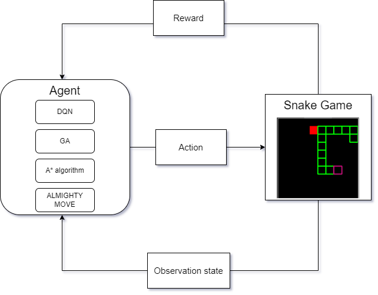
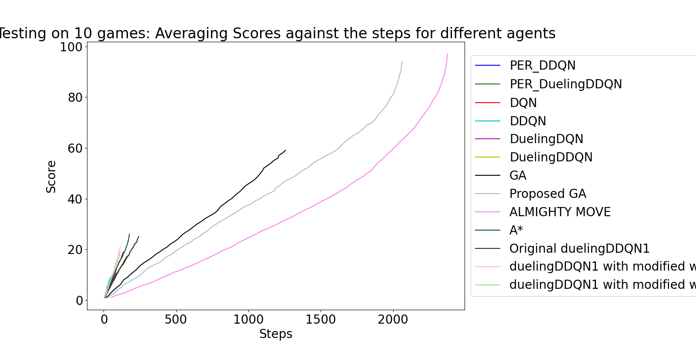

#Bing's Third year project for deep learning-based agents to play snake game with GUI

## Sections
- [Requirements](#requirements)
  - [Installation](#installation)
- [Snake Plugin](#snake-game-plugin)
    - [Usage](#usage)
    - [Main Mechanics](#main-mechanics)
        - [Screenshots](#screenshots)
    - [Issues](#issues)

## Requirements
### Installation
1. Make sure Python 3.9 installed from https://www.python.org/downloads/
2. To install all required libraries (better in a local virtual environment or a container to void libraries conflicts (Recommend [Anaconda])):
    1. ```pip install flappy_bird_gym```
    2. ```pip install -r requirements.txt```
3. To run DQN models, the GPU (CUDA) is required:
    1. Follow https://pytorch.org/get-started/locally/ to find what command to use 
    2. Checking with:
       1. ```import torch```
       2. ```torch.cuda.is_available() # return True ```
4. To get the code
    1. ```git clone https://github.com/wanghan8866/MyThirdYearProject1.git```
5. To run the GUI
    1. ```cd <PATH TO MyThirdYearProject1>```
    2. ```python main.py ```

## Usage
### GUI

This demo connected training and testing snake game agents with different algorithms. More details in each mode are in below [`Screenshots`](#screenshots). 



In this application, users can easily switch different algorithms like Deep Q-network, A* algorithm and Genetic algorithm. Also, for DQN and GA, users can fine-tune hypermeters easily for both training and testing. 
However, it is still recommended to test any models using the GUI and train them separately because training with GUI on is slow. 


### Deep Q-network (DQN) Training
> https://drive.google.com/drive/folders/1V5ClOaZ6bAV_lBsOidPfGs929SYmuAsL?usp=sharing
>
> Inspired by https://github.com/philtabor

This project contains codes for deep Q-network, double deep Q-network, Dueling Q-network, and prioritised experience replay from https://github.com/philtabor. Also, there are six different snake environments in the `PER/ranked`. 

The `training_main.py` can be used to set up training and testing for any variant DQN and its hyperparameters. After training is completed, the model with weights will be stored in the `models/` with a fold name of snake\_a\<agent name\>\_o\<obseration type\>\_r\<repeats\>\_\<reward type\>.
So, it is clear that agent name, observation type, repeats, and reward type are important hyperparameters in this project. Agent name is a string of any "Q", "DQN", "DDQN", "DuelingDQN", "DuelingDDQN", "PER_DuelingDDQN". The observation type can be either "1D" or "3D". The repeats here refer to any the number of frames in one state, and so it is a positive integer. 

From `models/` there are 1D observation models, and most of the 3D observation models are in this https://drive.google.com/drive/folders/1sJ08QIJcCy_irTkPALVNLcE65l1ICAtR?usp=sharing. So by default, it will likely throw errors because the corresponding 3D model does not exist, so please download the folder from the link. 

"plot_learning.py" allows the user to compare the playing behaviour of different agents to generate the plot in the following. 


### Genetic Algorithm (GA) Training
> https://github.com/wanghan8866/SnakeAI
> 
> Inspired by https://github.com/Chrispresso/SnakeAI

The genetic algorithm code is inspired by https://github.com/Chrispresso/SnakeAI. There are three snake game environments that are slightly different from each other and one completely different that uses the average of multiple runs of games total rewards as fitness called in `snakes.py`. The readme is from the original respiratory, and after adaptation in my project, the GUI is completely off for fast training, and users can easily switch the snake environments from `snakes.py` and `snake_env.py`. 

## Main Mechanics

### Screenshots

#### Main


> Main menu when you start the application.
> The main home page is where users can try three modes(single-player, training and experimenting) with the snake game AI. The bottom settings mode still needs to be completed later. 


#### Single-Player
> This single-player mode allows the user to select one game, and multiple agents support that game. 
For example, users can select Snake-Gen from the top options and choose any agent at the bottom. In this case, there are random agents, A* agents, genetic agents, and human and Q learning agents for the snake game.


>After pressing launch, a new window with at most four snake game canvases will pop up. 

#### Training


> For the training mode,  the player can select to train a snake game agent using either Deep Q-network (DQN) or a genetic algorithm. At the same time, users can choose different hyperparameters for the training process from the beginning or load pre-existing trained models in a working directory by clicking the open-a-directory button.


> After pressing launch, the training window pops up, where the user can observe the changes in the neuron network and training curve/progress.

> Training window, where a new agent is training, and you can change the speed and decide whether to display the neuron network.


> Training window, but loading from an existing agent.

 
> However, training with GUI is slow, instead the DQN model is trained using this code from
> https://drive.google.com/drive/folders/1V5ClOaZ6bAV_lBsOidPfGs929SYmuAsL?usp=sharing
> This code contains training with DQN, double-DQN, dueling Double-DQN and prioritised experience replay.
> Inspired by https://github.com/philtabor

> The genetic algorithm agent is trained using this code 
> https://github.com/wanghan8866/SnakeAI
> This code contains training with genetic algorithm.
> Inspired by https://github.com/Chrispresso/SnakeAI

#### Testing

> The first testing frame, where you can select up to four agents and observer their behaviour from a random start.


> The second testing frame, where you can select up to four agents and create a custom starting environment by clicking on the grid.
> Nodes are the pink node (head), green nodes (body), blue node (tail), and red node (apple).
> The colour of the node is determined by the number of right click and right click is to clear the node to empty.
> The game requires at least one node in each color, and it would be better to have only one pink and blue node. 


> The  testing window, where you can observe their behaviour and change the game speed.


## Issues
If there is any problem running the code, contact me by bing.wang-5@student.manchester.ac.uk.
It might be more content in [github].

[Anaconda]: https://www.anaconda.com/download
[discord]: https://discord.com/channels/874340350062362681/874340350062362684
[github]: https://github.com/wanghan8866/MyThirdYearProject1/new/master
