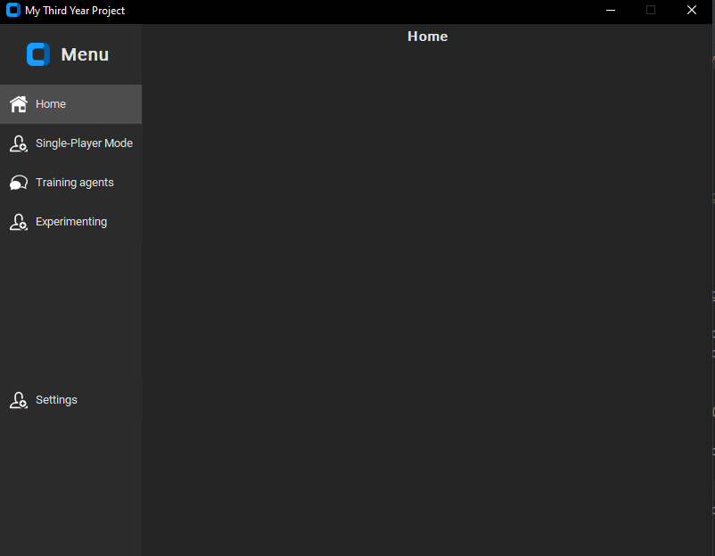
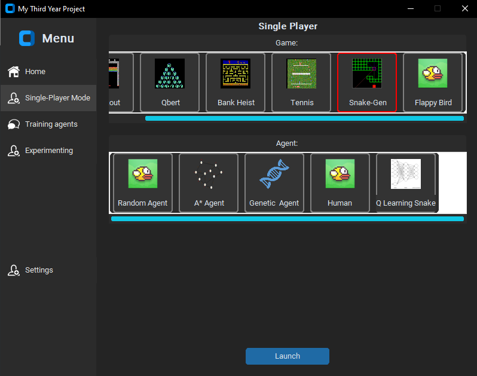
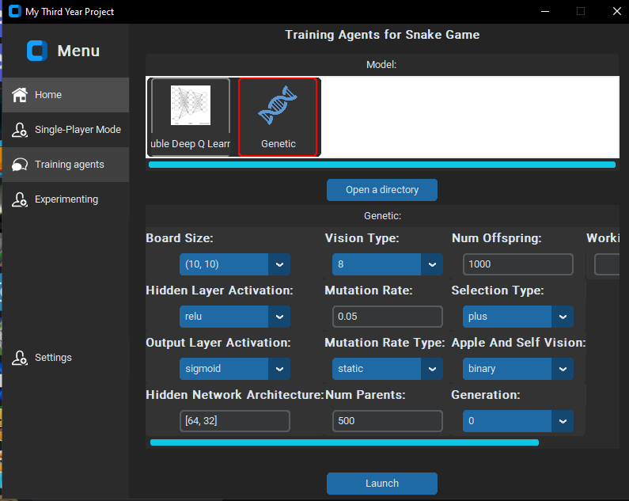
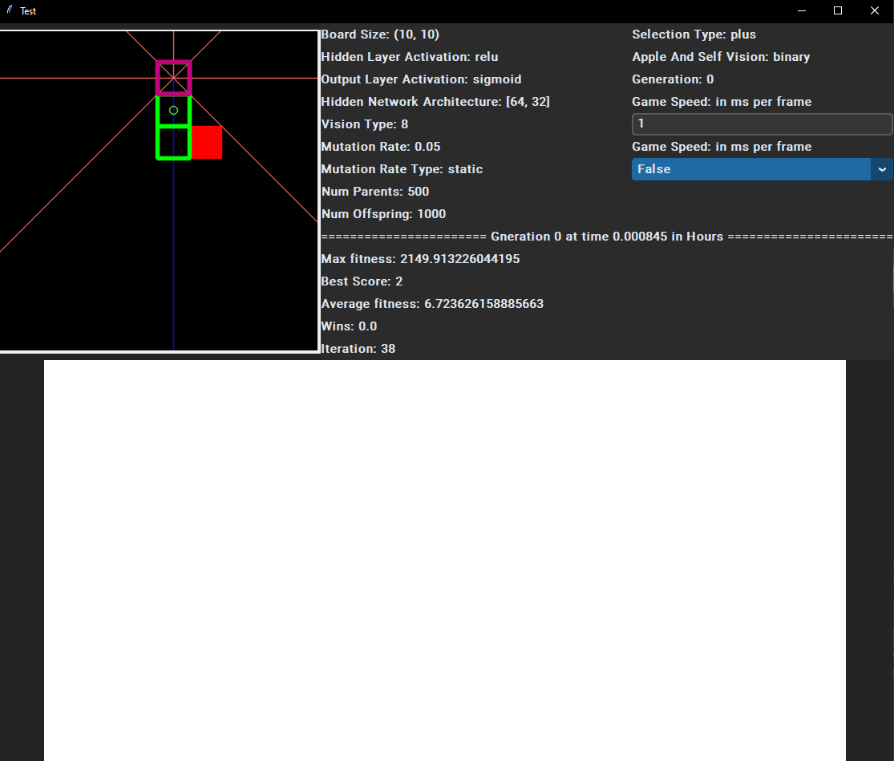
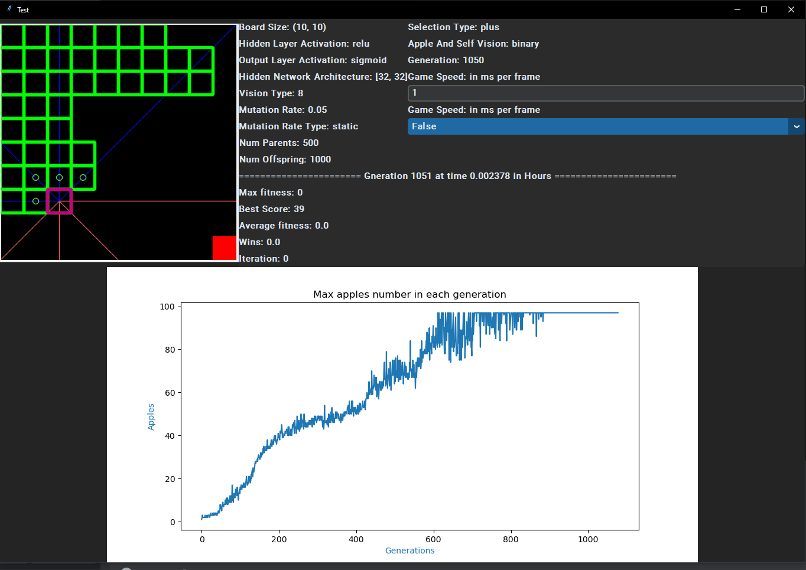
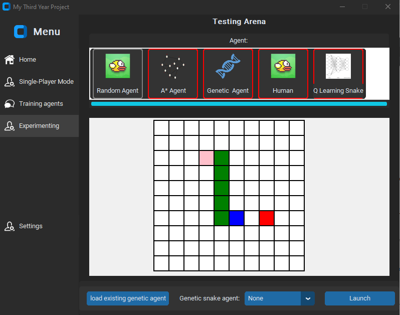
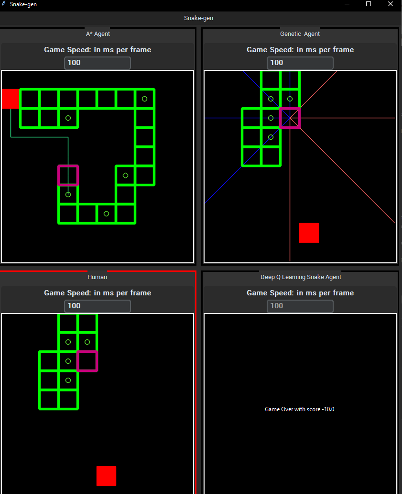

#Bing's Third year project for deep learning-based agents to play snake game with GUI

## Sections
- [Requirements](#requirements)
  - [Installation](#Installation)
- [Snake Plugin](#snake-game-plugin)
    - [Usage](#Usage)
    - [Main Mechanics](#main-mechanics)
        - [Screenshots](#screenshots)
    - [Issues](#Issues)

## Requirements
### Installation
1. Make sure Python 3.9 installed from https://www.python.org/downloads/
2. To install all required libraries (better in a local virtual environment or a container to void libraries conflicts):
    1. ```pip install flappy_bird_gym```
    2. ```pip install -r requirements.txt```
3. To run DQN models, the GPU (CUDA) is required:
    1. Follow https://pytorch.org/get-started/locally/ to find what command to use 
    2. Checking with:
       1. ```import torch```
       2. ```torch.cuda.is_available() # return True ```
4. To get the code
    1. ```git clone https://github.com/wanghan8866/MyThirdYearProject1.git```
5. To run the GUI
    1. ```cd <PATH TO MyThirdYearProject1>```
    2. ```python main.py ```

## Usage
### GUI
### Deep Q-network (DQN) Training
### Genetic Algorithm (GA) Training

$$ x = {-b \pm \sqrt{b^2-4ac} \over 2a} $$

## Main Mechanics

### Screenshots

#### Main


> Main menu when you start the application.
> The main home page is where users can try three modes(single-player, training and experimenting) with the snake game AI. The bottom settings mode still needs to be completed later. 


#### Single-Player
> This single-player mode allows the user to select one game, and multiple agents support that game. 
For example, users can select Snake-Gen from the top options and choose any agent at the bottom. In this case, there are random agents, A* agents, genetic agents, and human and Q learning agents for the snake game.


>After pressing launch, a new window with at most four snake game canvases will pop up. 

#### Training


> For the training mode,  the player can select to train a snake game agent using either Deep Q-network (DQN) or a genetic algorithm. At the same time, users can choose different hyperparameters for the training process from the beginning or load pre-existing trained models in a working directory by clicking the open-a-directory button.


> After pressing launch, the training window pops up, where the user can observe the changes in the neuron network and training curve/progress.

> Training window, where a new agent is training, and you can change the speed and decide whether to display the neuron network.


> Training window, but loading from an existing agent.

 
> However, training with GUI is slow, instead the DQN model is trained using this code from
> https://drive.google.com/drive/folders/1V5ClOaZ6bAV_lBsOidPfGs929SYmuAsL?usp=sharing
> This code contains training with DQN, double-DQN, dueling Double-DQN and prioritised experience replay.
> Inspired by https://github.com/philtabor

> The genetic algorithm agent is trained using this code 
> https://github.com/wanghan8866/SnakeAI
> This code contains training with genetic algorithm.
> Inspired by https://github.com/Chrispresso/SnakeAI

#### Testing

> The first testing frame, where you can select up to four agents and observer their behaviour from a random start.


> The second testing frame, where you can select up to four agents and create a custom starting environment by clicking on the grid.
> Nodes are the pink node (head), green nodes (body), blue node (tail), and red node (apple).
> The colour of the node is determined by the number of right click and right click is to clear the node to empty.
> The game requires at least one node in each color, and it would be better to have only one pink and blue node. 


> The  testing window, where you can observe their behaviour and change the game speed.


## Issues
If there is any problem running the code, contact me by bing.wang-5@student.manchester.ac.uk.
It might be more content in [github].

[discord]: https://discord.com/channels/874340350062362681/874340350062362684
[github]: https://github.com/wanghan8866/MyThirdYearProject1/new/master
